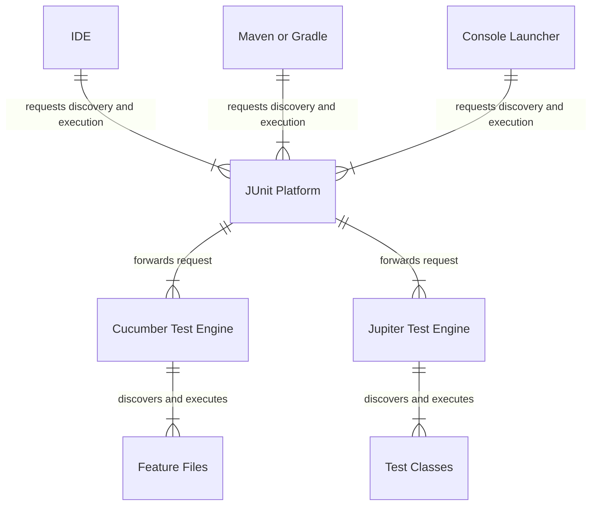
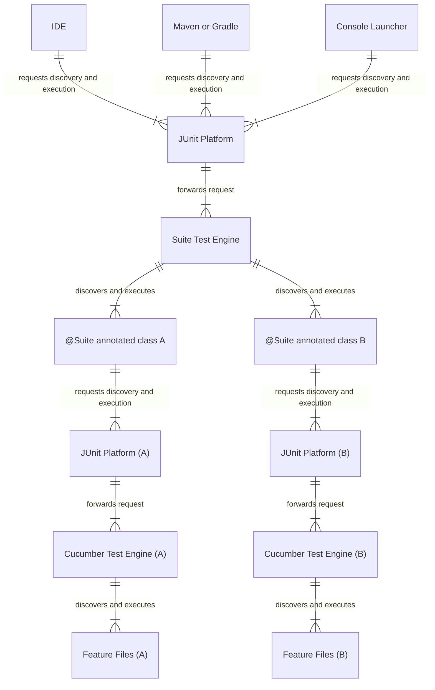

Cucumber JUnit Platform Engine
==============================

Use the JUnit (5) Platform to execute Cucumber scenarios.

Add the `cucumber-junit-platform-engine` dependency to your `pom.xml` and use
the [`cucumber-bom`](../cucumber-bom/README.md) for dependency management:

```xml
<dependency>
   <groupId>io.cucumber</groupId>
   <artifactId>cucumber-junit-platform-engine</artifactId>
   <scope>test</scope>
</dependency>
```

This will allow IntelliJ IDEA, Eclipse, Maven, Gradle, etc, to discover, select
and execute Cucumber scenarios.

## Running Cucumber

The JUnit Platform provides a single interface for tools and IDE's to discover,
select and execute tests from different test engines. Conceptually this looks
like this:




In practice, integration is still limited so we discuss the most common workarounds below.

### Maven Surefire, Gradle and SBT

Maven Surefire and Gradle do not yet support discovery of non-class based tests
(see: [gradle/#4773](https://github.com/gradle/gradle/issues/4773),
[maven-surefire/#2065](https://github.com/apache/maven-surefire/issues/2065), [stb-jupiter-interface/#142](https://github.com/sbt/sbt-jupiter-interface/issues/142)).
As a workaround, you can either use:
 * the [JUnit Platform Suite Engine](https://junit.org/junit5/docs/current/user-guide/#junit-platform-suite-engine);
 * the [JUnit Platform Console Launcher](https://junit.org/junit5/docs/current/user-guide/#running-tests-console-launcher) or;
 * the [Gradle Cucumber-Companion](https://github.com/gradle/cucumber-companion) plugins for Gradle and Maven.
 * the [Cucable](https://github.com/trivago/cucable-plugin) plugin for Maven.

#### Use the JUnit Platform Suite Engine

The JUnit Platform Suite Engine can be used to run Cucumber. See
[Suites with different configurations](#suites-with-different-configurations)
for a brief how to.

##### Maven and Gradle workarounds

Because Surefire and Gradle reports provide the results in a `<Class Name> - <Method Name>`
format, only scenario names or example numbers are reported. This
can make for hard to read reports. 

To improve the readability of the reports use the
`cucumber.junit-platform.naming-strategy` configuration parameter. This  will
include the feature name, scenario name, example number, etc. in the report.

```xml
<plugin>
    <groupId>org.apache.maven.plugins</groupId>
    <artifactId>maven-surefire-plugin</artifactId>
    <version>3.2.5</version>
    <configuration>
        <properties>
            <configurationParameters>
                cucumber.junit-platform.naming-strategy=surefire
            </configurationParameters>
        </properties>
    </configuration>
</plugin>
```            

```kotlin
tasks.test {
    useJUnitPlatform()
    systemProperty("cucumber.junit-platform.naming-strategy", "long")
}
```

##### IDEA workarounds

When running features through IDEA, the Cucumber CLI is used. The CLI looks for
configuration properties in `cucumber.properties` while JUnit looks for
`junit-platform.properties`. To avoid duplication you can use the
`@ConfigurationParametersResource` annotation to include `cucumber.properties`
into a Suite.

```java
@Suite
@IncludeEngines("cucumber")
@SelectPackages("com.example")
@ConfigurationParameter(key = GLUE_PROPERTY_NAME, value = "com.example")
@ConfigurationParametersResource("cucumber.properties")
public class RunCucumberTest {
}
```

##### SBT workarounds

The `sbt-jupiter-interface` assumes that all tests directly under a test engine
have a class source. This is not the case for Cucumber. By running Cucumber
indirectly through the JUnit Platform Suite Engine and disabling discovery when
run directly as a "root engine" this problem is avoided.

Add to `junit-platform.properties`: 

```
cucumber.junit-platform.discovery.as-root-engine=false
```

#### Use the JUnit Console Launcher ###

You can integrate the JUnit Platform Console Launcher in your build by using 
either the Maven Antrun plugin or the Gradle JavaExec task.

##### Use the Maven Antrun plugin  ####

Add the following to your `pom.xml`:

```xml
<dependencies>
   ....
   <dependency>
      <groupId>org.junit.platform</groupId>
      <artifactId>junit-platform-console</artifactId>
      <version>${junit-platform.version}</version>
      <scope>test</scope>
   </dependency>
</dependencies>

<build>
<plugins>
   <plugin>
      <groupId>org.apache.maven.plugins</groupId>
      <artifactId>maven-antrun-plugin</artifactId>
      <executions>
         <execution>
            <!--Work around. Surefire does not use JUnit's Test Engine discovery functionality -->
            <id>CLI-test</id>
            <phase>integration-test</phase>
            <goals>
               <goal>run</goal>
            </goals>
            <configuration>
               <target>
                  <echo message="Running JUnit Platform CLI"/>
                  <java classname="org.junit.platform.console.ConsoleLauncher"
                        fork="true"
                        failonerror="true"
                        newenvironment="true"
                        maxmemory="512m"
                        classpathref="maven.test.classpath">
                     <arg value="--include-engine"/>
                     <arg value="cucumber"/>
                     <arg value="--scan-classpath"/>
                     <arg value="${project.build.testOutputDirectory}"/>
                  </java>
               </target>
            </configuration>
         </execution>
      </executions>
   </plugin>
</plugins>
</build>
```
##### Use the Gradle JavaExec task  ####

Add the following to your `build.gradle.kts`:

```kotlin
tasks {

	val consoleLauncherTest by registering(JavaExec::class) {
		dependsOn(testClasses)
		val reportsDir = file("$buildDir/test-results")
		outputs.dir(reportsDir)
		classpath = sourceSets["test"].runtimeClasspath
		main = "org.junit.platform.console.ConsoleLauncher"
		args("--scan-classpath")
		args("--include-engine", "cucumber")
		args("--reports-dir", reportsDir)
	}

	test {
		dependsOn(consoleLauncherTest)
		exclude("**/*")
	}
}
```

### Running a single scenario or feature from the CLI

To select a single scenario or feature the `cucumber.features` property can be
used. Because this property will cause Cucumber to ignore any other selectors
from JUnit, it is prudent to execute only the Cucumber engine.

#### Maven

To select the scenario on line 10 of the `example.feature` file use:

```shell
mvn test -Dsurefire.includeJUnit5Engines=cucumber -Dcucumber.plugin=pretty -Dcucumber.features=path/to/example.feature:10 
```

#### Gradle

Define Cucumber properties before running the test to ensure that your `build.gradle`
(or `build.gradle.kts`) correctly passes system properties to the test task.

```groovy
tasks.test {
    systemProperty("cucumber.features", System.getProperty("cucumber.features"))
    systemProperty("cucumber.filter.tags", System.getProperty("cucumber.filter.tags"))
    systemProperty("cucumber.filter.name", System.getProperty("cucumber.filter.name"))
    systemProperty("cucumber.plugin", System.getProperty("cucumber.plugin"))
}
```

Then to select the scenario on line 10 of the `example.feature` file use:

```shell
gradle test --rerun-tasks --info -Dcucumber.plugin=pretty -Dcucumber.features=path/to/example.feature:10
```

Note: Because both the Suite Engine and the Cucumber Engine are included, this
will run tests twice. (If you know how to prevent this, please send a pull
request).

## Suites with different configurations

The JUnit Platform Suite Engine can be used to run Cucumber multiple times with
different configurations. Conceptually this looks like this:



To use, add the `junit-platform-suite` dependency and use
the [`junit-bom`](https://junit.org/junit5/docs/current/user-guide/#running-tests-build-maven-bom) for dependency management:

```xml
<dependency>
   <groupId>org.junit.platform</groupId>
   <artifactId>junit-platform-suite</artifactId>
   <scope>test</scope>
</dependency>
```

Then define suites as needed using the annotation from the
[`org.junit.platform.suite.api`](https://junit.org/junit5/docs/current/api/org.junit.platform.suite.api/org/junit/platform/suite/api/package-summary.html)
package:

```java
package com.example;

import org.junit.platform.suite.api.ConfigurationParameter;
import org.junit.platform.suite.api.IncludeEngines;
import org.junit.platform.suite.api.SelectPackages;
import org.junit.platform.suite.api.Suite;

import static io.cucumber.junit.platform.engine.Constants.GLUE_PROPERTY_NAME;

@Suite
@IncludeEngines("cucumber")
@SelectPackages("com.example")
@ConfigurationParameter(key = GLUE_PROPERTY_NAME, value = "com.example")
public class RunCucumberTest {
}
```

## Parallel execution ## 

By default, Cucumber runs tests sequentially in a single thread. Running tests
in parallel is available as an opt-in feature. To enable parallel execution, set
the `cucumber.execution.parallel.enabled` configuration parameter to `true`,
e.g., in `junit-platform.properties`.

To control properties such as the desired parallelism and maximum parallelism,
Cucumber supports JUnit 5s `ParallelExecutionConfigurationStrategy`. Cucumber
provides two implementations: `dynamic` and `fixed` that can be set through
`cucumber.execution.parallel.config.strategy`. You may also implement a `custom`
strategy.

* `dynamic`: Computes the desired parallelism as `<available cores>` * 
`cucumber.execution.parallel.config.dynamic.factor`.

* `fixed`: Set `cucumber.execution.parallel.config.fixed.parallelism` to the
  desired parallelism and `cucumber.execution.parallel.config.fixed.max-pool-size`
  to the maximum pool size of the underlying ForkJoin pool.

* `custom`: Specify a custom `ParallelExecutionConfigurationStrategy`
implementation through `cucumber.execution.parallel.config.custom.class`.  

If no strategy is specified Cucumber will use the `dynamic` strategy with a
factor of `1`.

Note: While `.fixed.max-pool-size` effectively limits the maximum number of
concurrent threads, Cucumber does not guarantee that the number of concurrently
executing scenarios will not exceed this. See [junit5/#3108](https://github.com/junit-team/junit5/issues/3108)
for details.

### Exclusive Resources ###

To avoid flaky tests when multiple scenarios manipulate the same resource, tests
can be [synchronized][junit5-user-guide-synchronization] on that resource.

[junit5-user-guide-synchronization]: https://junit.org/junit5/docs/current/user-guide/#writing-tests-parallel-execution-synchronization

To synchronize a scenario on a specific resource, the scenario must be tagged
and this tag mapped to a lock for the specific resource. A resource is
identified by an arbitrary string and can be either locked with a
read-write-lock, or a read-lock.
  
For example, the following tags:

```gherkin
Feature: Exclusive resources

   @reads-and-writes-system-properties
   Scenario: first example
      Given this reads and writes system properties
      When it is executed
      Then it will not be executed concurrently with the second example

   @reads-system-properties
   Scenario: second example
      Given this reads system properties
      When it is executed
      Then it will not be executed concurrently with the first example
```

with this configuration:

```properties
cucumber.execution.exclusive-resources.reads-and-writes-system-properties.read-write=java.lang.System.properties
cucumber.execution.exclusive-resources.reads-system-properties.read=java.lang.System.properties
```

when executing the first scenario tagged with
`@reads-and-writes-system-properties` will lock the `java.lang.System.properties`
resource with a read-write lock and will not be concurrently executed with the
second scenario that locks the same resource with a read lock.

Note: The `@` from the tag is not included in the property name.
Note: For canonical resource names see [junit5/Resources.java][resources-java]

[resources-java]: https://github.com/junit-team/junit5/blob/main/junit-jupiter-api/src/main/java/org/junit/jupiter/api/parallel/Resources.java

### Running tests in isolation

To ensure that a scenario runs while no other scenarios are running the global
resource [`org.junit.platform.engine.support.hierarchical.ExclusiveResource.GLOBAL_KEY`][global-key]
can be used.

[global-key]: https://github.com/junit-team/junit5/blob/main/junit-platform-engine/src/main/java/org/junit/platform/engine/support/hierarchical/ExclusiveResource.java#L47

```gherkin
Feature: Isolated scenarios

   @isolated
   Scenario: isolated example
      Given this scenario runs isolated
      When it is executed
      Then it will not be executed concurrently with the second or third example

   Scenario: second example
      When it is executed
      Then it will not be executed concurrently with the isolated example
      And it will be executed concurrently with the third example

   Scenario: third example
      When it is executed
      Then it will not be executed concurrently with the isolated example
      And it will be executed concurrently with the second example
```

with this configuration:

```properties
cucumber.execution.exclusive-resources.isolated.read-write=org.junit.platform.engine.support.hierarchical.ExclusiveResource.GLOBAL_KEY
```
### Executing features in parallel 

By default, when parallel execution is enabled, scenarios and examples are
executed in parallel. Due to limitations, JUnit 4 could only execute features in
parallel. This behaviour can be restored by setting the configuration parameter
`cucumber.execution.execution-mode.feature` to `same_thread`. 

## Configuration Options ##

Cucumber receives its configuration from the JUnit Platform. To see how these can be supplied; see the JUnit
documentation
[4.5. Configuration Parameters](https://junit.org/junit5/docs/current/user-guide/#running-tests-config-params). For 
documentation on Cucumber properties, see [Constants](src/main/java/io/cucumber/junit/platform/engine/Constants.java).

```
cucumber.ansi-colors.disabled=                                 # true or false. 
                                                               # default: false                     
       
cucumber.filter.name=                                          # a regular expression.
                                                               # only scenarios with matching names are executed.
                                                               # combined with cucumber.filter.tags using "and" semantics.
                                                               # example: ^Hello (World|Cucumber)$
                                                               # note: To ensure consistent reports between Cucumber and
                                                               # JUnit 5 prefer using JUnit 5s discovery request filters
                                                               # or JUnit 5 tag expressions instead.

cucumber.features=                                             # comma separated paths to feature files. 
                                                               # example: path/to/example.feature, path/to/other.feature
                                                               # note: When used any discovery selectors from the JUnit
                                                               # Platform will be ignored. This may lead to multiple
                                                               # executions of Cucumber. For example when used in
                                                               # combination with the JUnit Platform Suite Engine.
                                                               # When using Cucumber through the JUnit Platform
                                                               # Launcher API or the JUnit Platform Suite Engine, it is
                                                               # recommended to use JUnit's DiscoverySelectors or 
                                                               # Junit Platform Suite annotations.

cucumber.filter.tags=                                          # a cucumber tag expression.
                                                               # only scenarios with matching tags are executed.
                                                               # combined with cucumber.filter.name using "and" semantics.                                                               
                                                               # example: @Cucumber and not (@Gherkin or @Zucchini)
                                                               # note: To ensure consistent reports between Cucumber and
                                                               # JUnit 5 prefer using JUnit 5s discovery request filters
                                                               # or JUnit 5 tag expressions instead.

cucumber.glue=                                                 # comma separated package names.
                                                               # example: com.example.glue  

cucumber.junit-platform.discovery.as-root-engine               # true or false
                                                               # default: true
                                                               # enable discovery when used as a root engine.
                                                               # note: Workaround for SBT issues.

cucumber.junit-platform.naming-strategy=                       # long, short or surefire.
                                                               # default: short
                                                               # long: include parent descriptor names in test descriptor.
                                                               # surefire: Workaround to make test names appear nicely with Surefire.

cucumber.junit-platform.naming-strategy.short.example-name=    # number, number-and-pickle-if-parameterized or pickle.
                                                               # default: number-and-pickle-if-parameterized
                                                               # Use example number and/or pickle name for examples when
                                                               # short naming strategy is used

cucumber.junit-platform.naming-strategy.long.example-name=     # number, number-and-pickle-if-parameterized or pickle.
                                                               # default: number-and-pickle-if-parameterized
                                                               # Use example number and/or pickle name for examples when
                                                               # long naming strategy is used
                                                               
cucumber.junit-platform.naming-strategy.surefire.example-name= # number or pickle.
                                                               # default: number-and-pickle-if-parameterized
                                                               # Use example number or pickle name for examples when
                                                               # surefire naming strategy is used

cucumber.plugin=                                               # comma separated plugin strings.
                                                               # example: pretty, json:path/to/report.json

cucumber.uuid-generator                                        # uuid generator class name of a registered service provider.
                                                               # default: io.cucumber.core.eventbus.RandomUuidGenerator
                                                               # example: com.example.MyUuidGenerator
 
cucumber.object-factory=                                       # object factory class name.
                                                               # example: com.example.MyObjectFactory

cucumber.publish.enabled                                       # true or false. 
                                                               # default: false
                                                               # enable publishing of test results

cucumber.publish.quiet                                         # true or false. 
                                                               # default: false
                                                               # suppress publish banner after test execution.

cucumber.publish.token                                         # any string value.
                                                               # publish authenticated test results.

cucumber.snippet-type=                                         # underscore or camelcase.
                                                               # default: underscore

cucumber.execution.dry-run=                                    # true or false.
                                                               # default: false

cucumber.execution.execution-mode.feature=                     # same_thread or concurrent
                                                               # default: concurrent
                                                               # same_thread - executes scenarios sequentially in the 
                                                               # same thread as the parent feature 
                                                               # concurrent - executes scenarios concurrently on any
                                                               # available thread

cucumber.execution.order=                                     # lexical, reverse or random
                                                              # default: lexical
                                                              # lexical - executes features in lexical uri order, scenarios and examples from top to bottom 
                                                              # reverse - as lexical, but with the elements of each container reversed
                                                              # random - executes scenarios and examples in a random order within their parent container 

cucumber.execution.order.random.seed=                         # any long
                                                              # example: 20090120
                                                              # enables deterministic random execution  

cucumber.execution.parallel.enabled=                           # true or false.
                                                               # default: false

cucumber.execution.parallel.config.strategy=                   # dynamic, fixed or custom.
                                                               # default: dynamic

cucumber.execution.parallel.config.fixed.parallelism=          # positive integer.
                                                               # example: 4

cucumber.execution.parallel.config.fixed.max-pool-size=        # positive integer.
                                                               # example: 4

cucumber.execution.parallel.config.dynamic.factor=             # positive double.
                                                               # default: 1.0

cucumber.execution.parallel.config.custom.class=               # class name.
                                                               # example: com.example.MyCustomParallelStrategy

cucumber.execution.exclusive-resources.<tag-name>.read-write=  # a comma separated list of strings
                                                               # example: resource-a, resource-b.

cucumber.execution.exclusive-resources.<tag-name>.read=        # a comma separated list of strings
                                                               # example: resource-a, resource-b
```

## Supported Discovery Selectors and Filters ## 

JUnit 5 [introduced a test discovery mechanism](https://junit.org/junit5/docs/current/user-guide/#launcher-api-discovery)
as a dedicated feature of the platform itself. This allows IDEs and build tools
to identify tests. Supported `DiscoverySelector`s are:

* `ClasspathRootSelector`
* `ClasspathResourceSelector`
* `ClassSelector`
* `PackageSelector`
* `FileSelector`
* `DirectorySelector`
* `UriSelector`
* `UniqueIdSelector`

The only supported `DiscoveryFilter` is the `PackageNameFilter` and only when
features are selected from the classpath.

### Selecting individual scenarios, rules and examples ###

The `FileSelector` and `ClasspathResourceSelector` support a `FilePosition`.

 * `DiscoverySelectors.selectClasspathResource("rule.feature", FilePosition.from(5))`
 * `DiscoverySelectors.selectFile("rule.feature", FilePosition.from(5))`

The `UriSelector` supports URI's with a `line` query parameter:
  - `classpath:/com/example/example.feature?line=20`
  - `file:/path/to/com/example/example.feature?line=20`

Any `TestDescriptor` that matches the line *and* its descendants will be included in the discovery result. For example,
selecting a `Rule` will execute all scenarios contained within the Rule.

## Tags ##

Cucumber tags are mapped to JUnit tags. Note that the `@` symbol is not part of
the JUnit tag. So the scenarios below are tagged with `Smoke` and `Sanity`. 

```gherkin
@Smoke
@Ignore
Scenario: A tagged scenario
  Given I tag a scenario 
  When I select tests with that tag for execution 
  Then my tagged scenario is executed

@Sanity
Scenario: Another tagged scenario
  Given I tag a scenario 
  When I select tests with that tag for execution 
  Then my tagged scenario is executed
```

When using Maven, tags can be provided from the CLI using the `groups` and `excludedGroups` parameters. These take a
[JUnit5 Tag Expression](https://junit.org/junit5/docs/current/user-guide/#running-tests-tag-expressions). The example
below will execute `Another tagged scenario`.

```
mvn verify -DexcludedGroups="Ignore" -Dgroups="Smoke | Sanity"
```

For more information on how to select tags, see the relevant documentation:
* [JUnit 5 Suite: @Include Tags](https://junit.org/junit5/docs/current/api/org.junit.platform.suite.api/org/junit/platform/suite/api/IncludeTags.html)
* [JUnit 5 Suite: @Exclude Tags](https://junit.org/junit5/docs/current/api/org.junit.platform.suite.api/org/junit/platform/suite/api/ExcludeTags.html)
* [JUnit 5 Console Launcher: Options](https://junit.org/junit5/docs/current/user-guide/#running-tests-console-launcher-options)
* [JUnit 5 Tag Expression](https://junit.org/junit5/docs/current/user-guide/#running-tests-tag-expressions)
* [Maven: Filtering by Tags](https://maven.apache.org/surefire/maven-surefire-plugin/examples/junit-platform.html)
* [Gradle: Test Grouping](https://docs.gradle.org/current/userguide/java_testing.html#test_grouping)

### @Disabled

It is possible to recreate JUnit Jupiter's `@Disabled` functionality by
setting the `cucumber.filter.tags=not @Disabled` property<sup>1</sup>. Any scenarios 
tagged with `@Disabled` will be skipped. See [Configuration Options](#configuration-options)
for more information. 

1. Do note that this is a [Cucumber Tag Expression](https://cucumber.io/docs/cucumber/api/#tags) rather than a JUnit5
   tag expression.

## Aborting Tests

Cucumber supports [OpenTest4Js](https://github.com/ota4j-team/opentest4j)
`TestAbortedException`. This makes it possible to use JUnit Jupiter's
`Assumptions` to abort rather than fail a scenario.

```java
package com.example;

import io.cucumber.java.Before;
import org.junit.jupiter.api.Assumptions;

import java.util.List;

public class RpnCalculatorSteps {

   @Before
   public void before() {
       boolean condition = // decide if tests should abort
       Assumptions.assumeTrue(condition, "Condition not met");
   }
}
```

## Rerunning Failed Scenarios ##

When using `cucumber-junit-platform-engine` rerun files are not supported.
Use either Maven, Gradle or the JUnit Platform Launcher API.

### Using Maven

When running Cucumber through the [JUnit Platform Suite Engine](use-the-jUnit-platform-suite-engine)
use [`rerunFailingTestsCount`](https://maven.apache.org/surefire/maven-surefire-plugin/examples/rerun-failing-tests.html).

Note: any files written by Cucumber will be overwritten during the rerun.

```xml
<plugin>
    <groupId>org.apache.maven.plugins</groupId>
    <artifactId>maven-surefire-plugin</artifactId>
    <version>3.2.5</version>
    <configuration>
        <rerunFailingTestsCount>2</rerunFailingTestsCount>
        <properties>
            <!-- Work around. Surefire does not include enough
                 information to disambiguate between different
                 examples and scenarios. -->
            <configurationParameters>
                cucumber.junit-platform.naming-strategy=surefire
            </configurationParameters>
        </properties>
    </configuration>
</plugin>
```

### Using Gradle.

Gradle support for JUnit 5 is rather limited 
[gradle#4773](https://github.com/gradle/gradle/issues/4773), 
[junit5#2849](https://github.com/junit-team/junit5/issues/2849).
As a workaround you can the [Gradle Cucumber-Companion](https://github.com/gradle/cucumber-companion)
plugin in combination with [Gradle Test Retry](https://github.com/gradle/test-retry-gradle-plugin)
plugin.

Note: any files written by Cucumber will be overwritten while retrying.

### Using the JUnit Platform Launcher API

```java
package com.example;

import org.junit.platform.engine.discovery.DiscoverySelectors;
import org.junit.platform.engine.discovery.UniqueIdSelector;
import org.junit.platform.launcher.Launcher;
import org.junit.platform.launcher.LauncherDiscoveryRequest;
import org.junit.platform.launcher.TestIdentifier;
import org.junit.platform.launcher.core.LauncherFactory;
import org.junit.platform.launcher.listeners.SummaryGeneratingListener;
import org.junit.platform.launcher.listeners.TestExecutionSummary;
import org.junit.platform.launcher.listeners.TestExecutionSummary.Failure;

import java.util.List;
import java.util.stream.Collectors;

import static org.junit.platform.engine.discovery.DiscoverySelectors.selectDirectory;
import static org.junit.platform.launcher.core.LauncherDiscoveryRequestBuilder.request;

public class RunCucumber {

   public static void main(String[] args) {

      LauncherDiscoveryRequest request = request()
              .selectors(
                      selectDirectory("path/to/features")
              )
              .build();

      Launcher launcher = LauncherFactory.create();
      SummaryGeneratingListener listener = new SummaryGeneratingListener();
      launcher.registerTestExecutionListeners(listener);
      launcher.execute(request);

      TestExecutionSummary summary = listener.getSummary();
      // Do something with summary

      List<UniqueIdSelector> failures = summary.getFailures().stream()
              .map(Failure::getTestIdentifier)
              .filter(TestIdentifier::isTest)
              .map(TestIdentifier::getUniqueId)
              .map(DiscoverySelectors::selectUniqueId)
              .collect(Collectors.toList());

      LauncherDiscoveryRequest rerunRequest = request()
              .selectors(failures)
              .build();

      launcher.execute(rerunRequest);

      TestExecutionSummary rerunSummary = listener.getSummary();
      // Do something with rerunSummary
   }

}
```
