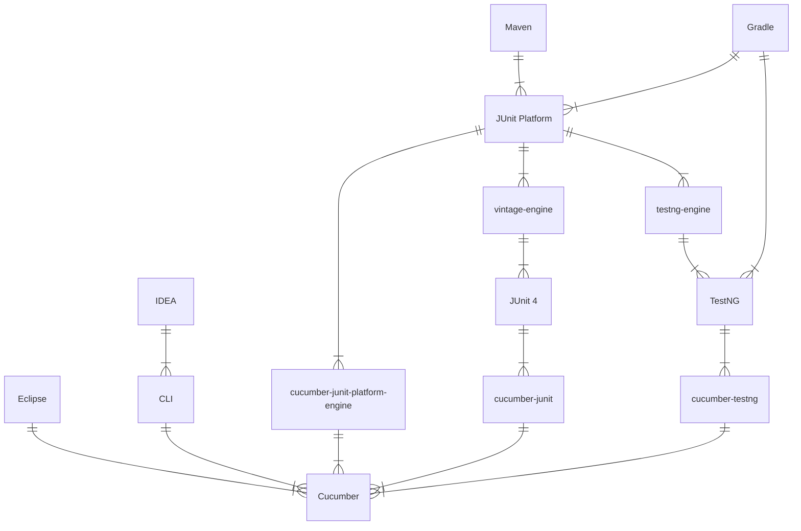
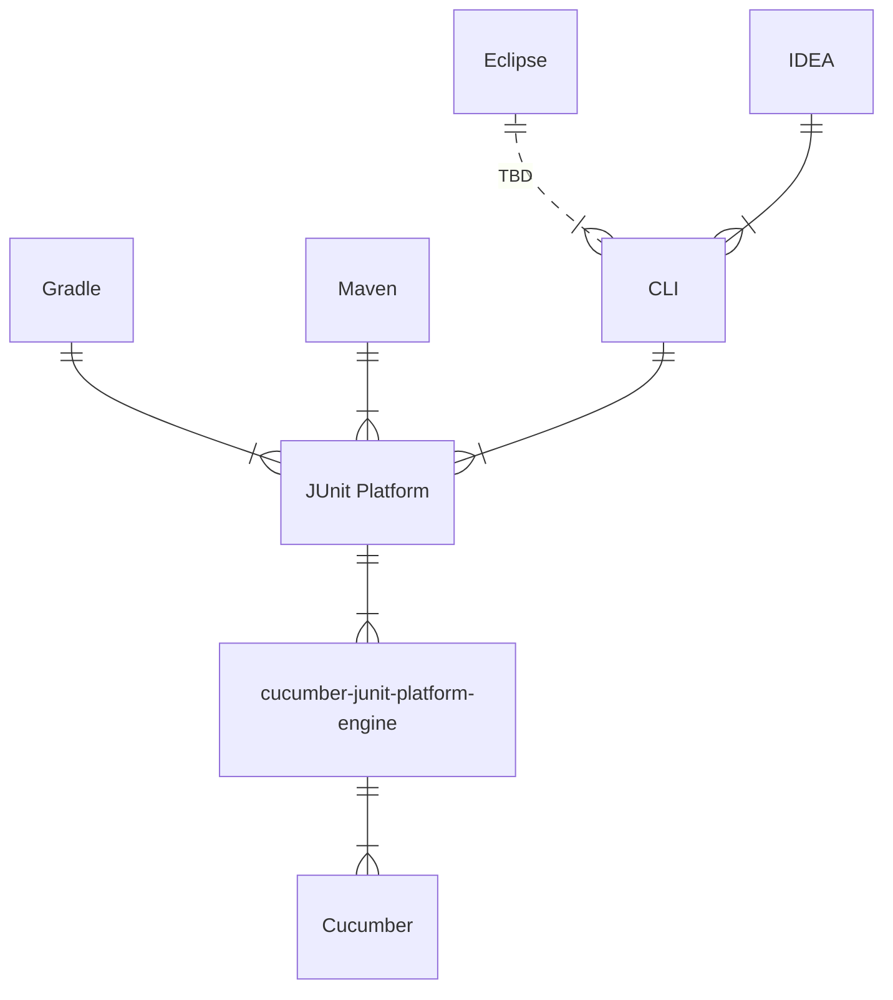

Cucumber-JVM v8.0.0
===================

It has been about five years since the last major version. Looking back, we've
gone through a lot of small incremental improvements. And this release shouldn't
be too different but for the upgrade to Java 17.

Below we'll discuss some notable changes in v8.0.0. As always the full change
log can be found in [the usual place](../CHANGELOG.md).

Java 17
-------

Cucumber-JVM v8 requires Java 17 to run. By upgrading to Java 17 we are
following other widely used projects like JUnit, Jackson, Spring and AssertJ. It
appears the industry has moved on from Java 8.

With the Java 17 upgrade also comes the ability to specify nullability through
[JSpecify](https://jspecify.dev/). If you are already using JSpecify or Kotlin
you may now see nullability related warnings.

Jackson is now an opt-in dependency
-----------------------------------

Jackson is no longer shaded in with Cucumber and must be provided when using the
`messages`, `timeline`, `json`, `usage-json`, or `html` plugins.

When upgrading ensure there is a dependency on Jackson 2:

* `com.fasterxml.jackson.core:jackson-databind`
* `com.fasterxml.jackson.datatype:jackson-datatype-jdk8`

Or a dependency on Jackson 3:

* `tools.jackson.core:jackson-databind`.

If you can't use Jackson, but can use another well known serialization library,
please create an issue.

JUnit Platform 6.1
------------------

The Cucumber JUnit Platform Engine has been updated to use the JUnit Platform
6.1.3. Please review [JUnits release notes](https://docs.junit.org/6.1.3/release-notes.html)
for details. Though but for the upgrade to Java 17, this too should be an
incremental upgrade. 

Declare step definitions and hooks with minimal ceremony
--------------------------------------------------------

Cucumber now allows step definitions and hooks using package private and
protected methods in addition to public methods. This reduces the ceremony
needed to declare a step definitions.

Before:

```java
public class StepDefinition {

    private final Belly belly;

    public StepDefinitions(Belly belly) {
        this.belly = belly;
    }

    @Given("I have {int} {word} in my belly")
    public void I_have_n_things_in_my_belly(int n, String what) {
        belly.setContents(Collections.nCopies(n, what));
    }

    @Then("there are {int} cukes in my belly")
    public void checkCukes(int n) {
        assertEquals(belly.getContents(), Collections.nCopies(n, "cukes"));
    }
}
```

After:

```java
class StepDefinition {

    private final Belly belly;

    StepDefinitions(Belly belly) {
        this.belly = belly;
    }

    @Given("I have {int} {word} in my belly")
    void I_have_n_things_in_my_belly(int n, String what) {
        belly.setContents(Collections.nCopies(n, what));
    }

    @Then("there are {int} cukes in my belly")
    void checkCukes(int n) {
        assertEquals(belly.getContents(), Collections.nCopies(n, "cukes"));
    }
}
```

Depending on the dependency injection framework in use, the classes declaring
step definitions and hooks can also be package private or protected in addition
to public. See the table below for details:

| Factory                   | Public | Package Private | protected |
|---------------------------|--------|-----------------|-----------|
| cucumber-core (default)   | Yes    | Yes             | Yes       |
| cucumber-guice            | Yes    | Yes             | Yes       |
| cucumber-jakarata-cdi     | Yes    | Yes             | Yes       |
| cucumber-jakarata-openejb | Yes    | Yes             | Yes       |
| cucumber-picocontainer    | Yes    | **No**          | **No**    |
| cucumber-spring           | Yes    | Yes             | Yes       |

Effectively only `cucumber-picocontainer` requires that classes declaring
step definitions are public and have a public constructor. The step
definitions themselves do not have to be public.

Support for registering individual glue classes
-----------------------------------------------

Cucumber scans the classpath for glue classes in packages selected through the
`--glue` command line option and `cucumber.glue` property. It is now also
possible to provide individual glue classes through the `--glue-classes` command
line option or `cucumber.glue.classes` property.

This should help users in situations where classpath scanning is not
possible (e.g. GraalVM).

Support class filtering before class loading
--------------------------------------------

Cucumber now supports filtering glue classes by name when scanning the classpath
via the `cucumber.glue.{included,excluded}-class-name-pattern` properties and
`--glue-{included,excluded}-class-name-pattern` CLI options.

Only classes that are included by one of the include patterns and not excluded
by any of the exclude patterns will be loaded during classpath scanning. This
should speed up Cucumber significantly. The filters are not applied against
classes that registered explicitly with `--glue-classes` or
`cucumber.glue.classes`.

Note: When using `cucumber-java` Cucumber will log a warning if class path
scanning could be improved by filtering glue classes.

Support both DocString and DataTable arguments on steps
-------------------------------------------------------

Gherkin has been upgraded to v42 and now supports providing both doc strings and
datatables as step arguments at the same time. So it is now possible to write
steps like this:

```gherkin
Scenario: Reviewing an AML alert narrative
  When the alert narrative is reviewed against the escalation matrix
    | trigger                    | threshold        | escalation level |
    | rapid movement of funds    | over 10000 EUR   | enhanced review  |
    | high-risk jurisdiction     | any amount       | enhanced review  |
    | inconsistent income source | repeated pattern | manual review    |
    """
        The customer received three incoming transfers from unrelated accounts
        and moved the funds to a newly added beneficiary within ten minutes.
        The declared source of income is part-time employment.
        """
  Then the alert should be escalated for enhanced review
```

With a step definitions like this:

```java
class StepDefinitions {

    @When("the alert narrative is reviewed against the escalation matrix")
    void narrative_is_reviewed(Datatable escalationMatrix, DocString alertNarrative) {

    }
}
```

Note: This is still a work in progress. While Cucumber-JVM can run these steps,
the reporting hasn't caught up yet.

Cucumber-TestNG and Cucumber-JUnit have been deprecated for removal
-------------------------------------------------------------------

The modules `cucumber-testng` and `cucumber-junit` (for JUnit 4) have been
deprecated for removal. Please switch to
the [cucumber-junit-platform-engine](https://github.com/cucumber/cucumber-jvm/tree/main/cucumber-junit-platform-engine).
If there are missing features that prevent you from upgrading please create an
issue.

Cucumber can be run through the CLI, JUnit Platform, JUnit 4 and TestNG. And to
some degree programmatically by using the `Runtime` class. Facilitating the
needs of all these different runners results in a lot of design strain.

Historically speaking this was necessary. Build tools like Gradle and Maven only
supported JUnit and TestNG. So Cucumber had to integrate with them. But since
the introduction of the JUnit Platform things look different.



As of v3.6.0 Maven Surefire [uses the JUnit Platform exclusively](https://maven.apache.org/surefire/maven-surefire-plugin/examples/junit-platform.html)
and Gradle v9.4.0 supports the [discovery of resource based tests](https://docs.gradle.org/current/userguide/java_testing.html#sec:non-class-based-testing)
on the JUnit Platform. This removes the need to keep `cucumber-junit` for JUnit
4 and `cucumber-testng` around. Removing these in the future will then allow
Cucumbers architecture to be simplified significantly:



Removed Java EE support in favor of Jakarta
-------------------------------------------

With Java EE being replaced with Jakarta so has:

* `cucumber-openejb` been removed in favor of `cucumber-jakarta-openejb`
* `cucumber-cdi2` been removed in favor of `cucumber-jakarta-cdi`
* `cucumber-deltaspike` been removed without replacement due to a lack of
  community interest. 
